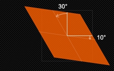

## 2D

2D 常用的变形函数： tranlate() 、 scale() 、 rotate() 、 skew() 、 matrix() 。
<!-- more -->

### skew() 函数

示例：

{% iframe ../demos/css%20skew.html 100% 320 %}

下图描述了`skew(30deg, 10deg)`的工作原理：

> **注：**上图来自 [http://dtop.powereasy.net/Item/3715.aspx](http://dtop.powereasy.net/Item/3715.aspx) 。

### transform-origin

transform-origin 用来指定元素变形的中心点位置，默认就是元素的中心点。

但是，对于位移 translate() 函数来说，无论 transform-origin 如何改变，都是以元素中心点为基准进行位移，例如：

{% iframe ../demos/transform-origin.html 100% 440 %}

`示例1`和`示例2`中的虚线框是元素的原始位置，实线框是位移之后的位置。`示例1`的 transform-origin 是`50% 50%`，而`示例2`是`100% 100%`，但是从最终偏移效果来看，两者的结果是一样的，所以 tranform-origin 对 translate() 函数并没有影响。

## 3D

3D 常用变形函数： translate3d() 、 translate() 、 scale3d() 、 scaleZ() 、 rotate3d() 、 rotateX() 、 rotateY() 、 rotateZ() 、 perspective() 、 matrix3d() 。

### transform-style

transform-style 的取值为 `flat` 或者 `preserve-3d` 。下面的例子展示了两者的差别：

{% iframe ../demos/transform-style.html 100% 416 %}

从示例中可以看出， `preserve-3d` 会让子元素在父元素变形的基础上继续变形，而 `flat` 则会消除父元素变形对子元素变形带来的影响。

__理解：__

对于第一种 `div.container1` 元素的 transform-style 为 `flat` 的情形，表明其所有子元素在 2D 空间中呈现，于是相对于 2D 平面（就可以理解为显示器的那个平面）做变形；对于第二种 `div.container1` 元素的 transform-style 为 `preserve-3d` 的情形，表明其所有子元素在 3D 空间中呈现，于是相对于当前 `div.container1` 为基准的平面做变形。
